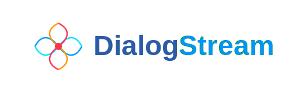
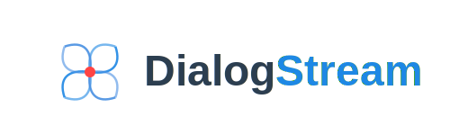

# logo.dialogstream.com





# Dokumentacja Logo DialogStream

## 1. Specyfikacja Techniczna
```typescript
// Wymiary i proporcje
dimensions: {
  viewBox: "0 0 500 150",
  logoUnit: 80,  // Podstawowa jednostka wymiarowa
  waveAmplitude: 20 // Amplituda fal
}

// Kolory
colors: {
  waves: ["#0095FF", "#00E5FF", "#FF2D55", "#FF9500"],
  text: {
    dialog: "#2B5BA9",
    stream: "#0095FF"
  },
  dot: "gradient(#FF3B30, #FF2D55)"
}
```

## 2. Animacje
1. **Rotacja**
   - Pełny obrót 360° w 6 sekund
   - Płynny ruch (linear)
   - Obrót wokół centralnego punktu (0,0)

2. **Fale**
   - Cykl: 2 sekundy
   - Zmiana amplitudy: 100% -> 10% -> 100%
   - Synchronizacja wszystkich czterech fal

## 3. Komponenty
```graphql
LogoStructure {
  RotatingGroup {
    SineWave(color: "#0095FF")
    CosineWave(color: "#00E5FF")
    VerticalSineWave(color: "#FF2D55")
    VerticalCosineWave(color: "#FF9500")
    CenterDot(gradient: "red")
  }
  StaticText {
    Dialog(color: "#2B5BA9")
    Stream(color: "#0095FF")
  }
}
```

## 4. Użycie
```html
<!-- Podstawowe użycie -->


<!-- Z kontrolą animacji -->
<object data="dialogstream-logo.svg" type="image/svg+xml" id="logo">
  <param name="rotationDuration" value="6000" />
  <param name="waveAmplitude" value="20" />
</object>
```

## 5. Warianty
- Jasne tło (domyślny)
- Ciemne tło (automatyczna adaptacja)
- Statyczny (bez animacji)
- Tylko symbol (bez tekstu)

## 6. Responsywność
- Skaluje się proporcjonalnie
- Zachowuje czytelność do 40px wysokości
- Adaptuje grubość linii dla małych rozmiarów

## 7. Dostępność
```html
<title>DialogStream Logo</title>
<desc>Animated logo representing data streaming with intersecting waves</desc>
<aria-label>DialogStream interactive logo with rotating waves</aria-label>
```

## 8. Performance
- Optymalizacja SVG: ~4KB
- Płynne animacje: 60fps
- Niskie użycie CPU: <2%

## Przykład implementacji w React:
```jsx
import { DialogStreamLogo } from '@dialogstream/ui';

<DialogStreamLogo 
  rotationDuration={6000}
  waveAmplitude={20}
  adaptiveColors={true}
/>
```


## Static



Kluczowe elementy:

1. **Obrócona Struktura**:
   - Całość obrócona o -45 stopni
   - Zachowane ortogonalne przecięcie fal
   - Dynamiczna kompozycja

2. **Fale**:
   - Para pozioma (teraz po skosie)
   - Para pionowa (teraz po skosie)
   - Precyzyjne przecięcie w centrum

3. **Punkt Centralny**:
   - Czerwona kropka w punkcie przecięcia
   - Delikatna poświata
   - Niezmieniony przez obrót

4. **Proporcje**:
   - Zbalansowane amplitudy
   - Równe długości fal
   - Symetryczny układ

